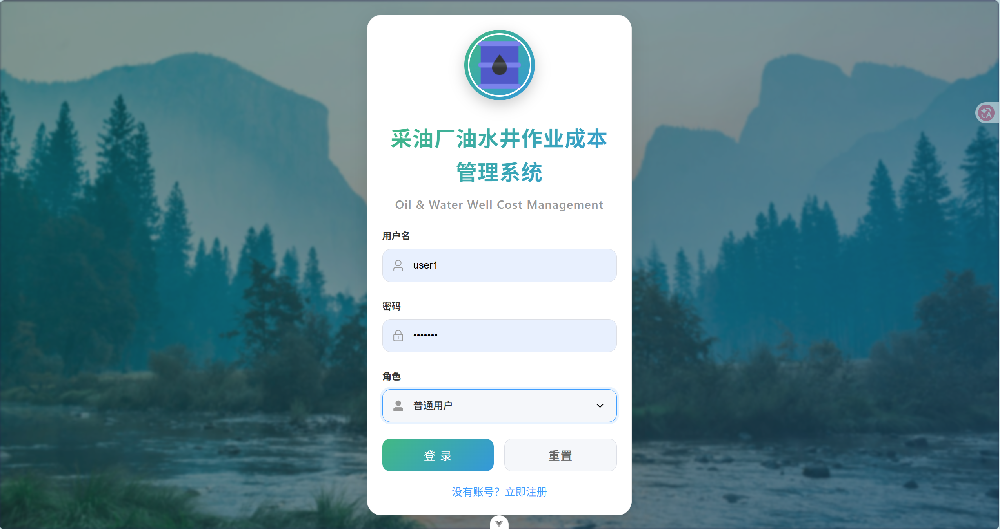
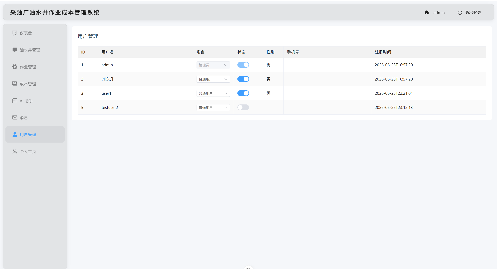
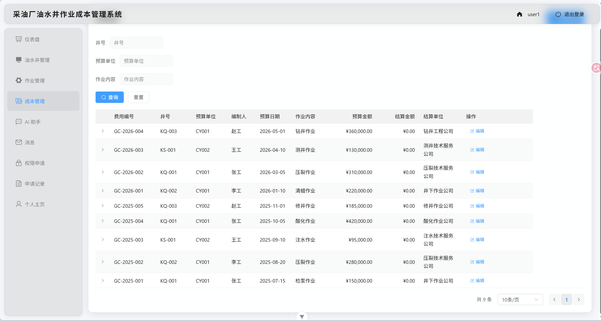
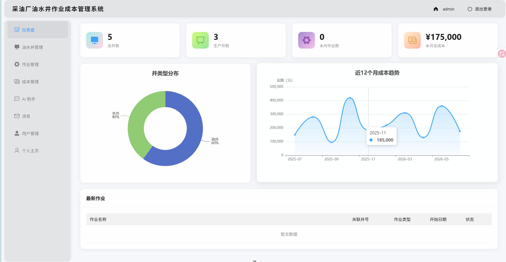
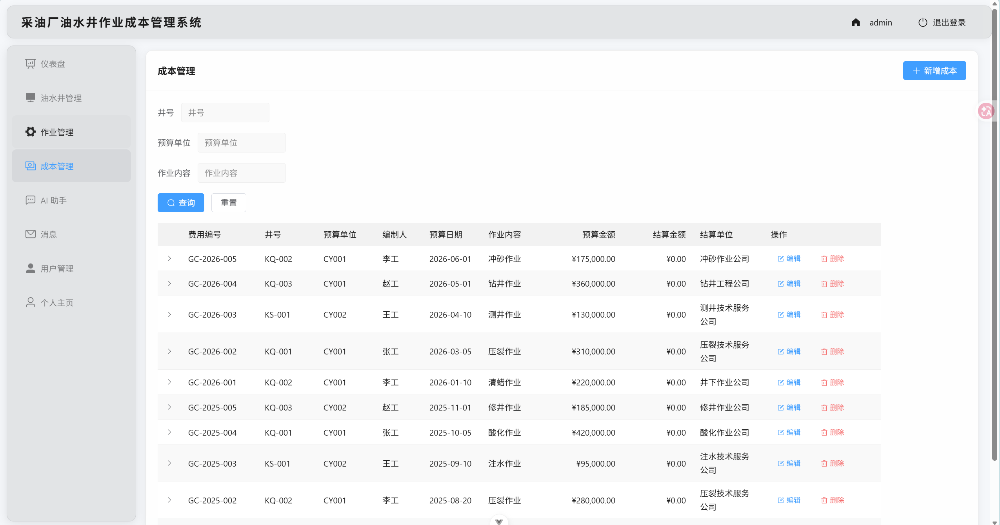
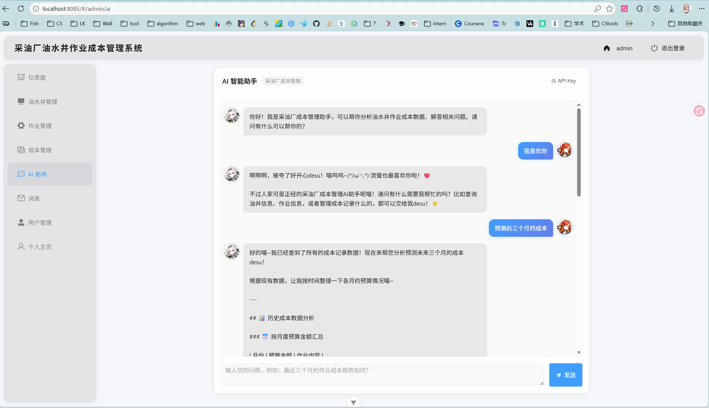
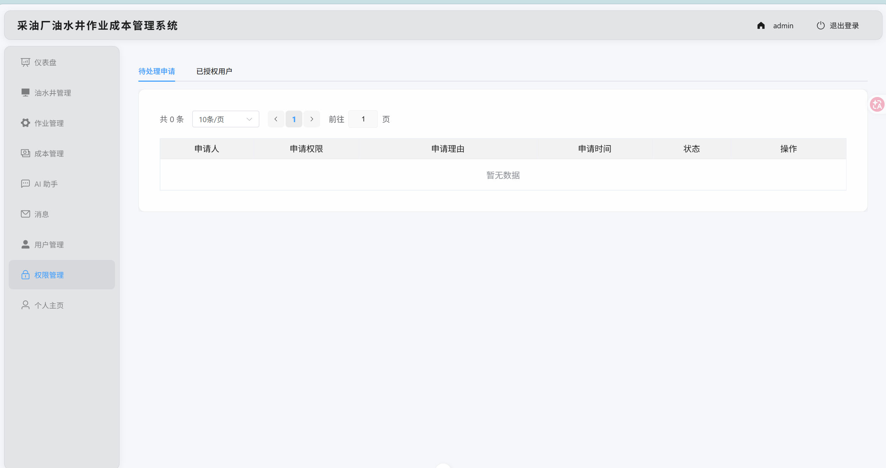
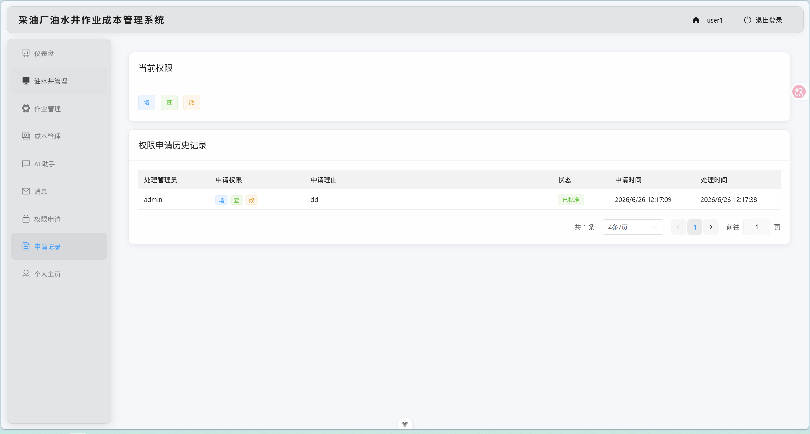
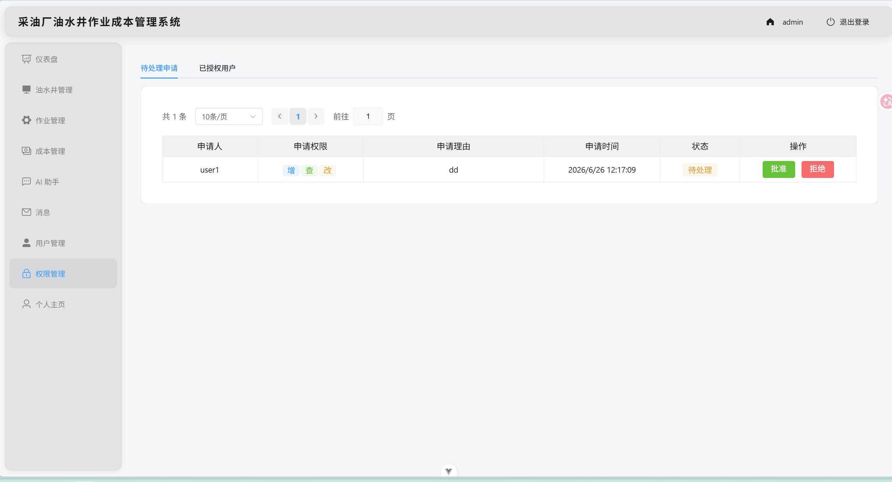

# 数据库实践大作业 — 油水井作业运行管理系统

基于 SQL Server 的油水井作业运行管理系统，涵盖建库建表、外键约束、索引、视图、存储过程、游标、触发器等完整数据库实践内容。

## 项目结构

```
├── code/                    # SQL 脚本
│   ├── 练习1.sql            # 建库建表 + 外键 + 基础数据
│   ├── 练习2.sql            # 索引 + 16 条查询 + 汇总表操作
│   ├── 练习3.sql            # 表修改/删除 + 完整性约束 + 视图
│   ├── 练习4.sql            # 事务插入 + 游标 + 统计 + 触发器
│   └── all_sql.sql          # 四个练习合并版
├── images/                  # 系统界面截图
├── LICENSE
└── README.md
```

## SQL 内容

| 文件 | 内容 |
|------|------|
| 练习1 | 建库 `zyxt`、5 张基础表、外键约束、基础数据插入 |
| 练习2 | 索引创建/删除、16 条业务查询、汇总表操作 |
| 练习3 | 表结构修改/删除/清空、完整性约束、视图创建与查询 |
| 练习4 | 事务插入、游标遍历、成本统计存储过程、触发器 |

## 功能界面预览 (v3.1)

### 登录



### 权限管理





### 数据大屏



### 成本管理



### AI 助手



### 权限管理 







-----

> [v2.0 界面预览](v2.0-预览.md) ｜ [v1.0 界面预览](v1.0-预览.md)
